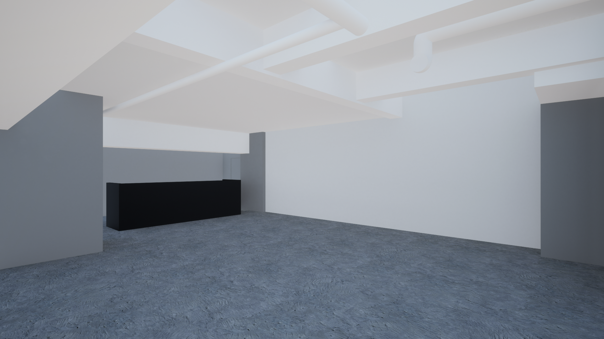

# fil - Where Creative Threads Intertwine

"fil" (pronounced "feel") means "thread" in French. It's a space where creators from various fields gather to spin threads of ideas and weave the fabric of new creation.

Run by **Daito Manabe**, this space aims to be a 21st-century salon where creators, artists, engineers, and musicians interact beyond boundaries. In our modern era, where technology and art converge, cross-disciplinary dialogue and collaboration are key to fostering innovation.

「fil」(フィル)は、フランス語で「糸」を意味します。ここでは、さまざまな分野のクリエイターたちが音楽を中心に集い、アイデアという糸を紡ぎ、新たな創造の布を織り上げていく場所です。

真鍋大度が手掛けるこの革新的なスペースは、クリエーター、アーティスト、エンジニア、ミュージシャンが垣根を超えて交流する、21世紀型のサロンを目指しています。技術と芸術が融合する現代において、分野を超えた対話と協働がイノベーションを生み出す鍵となります。

---

## Activities / 活動内容

At fil, the following activities take place:

1.  **Interdisciplinary workshops and talk sessions**
    *分野横断的なワークショップとトークセッション*
2.  **Exhibitions of art pieces utilizing cutting-edge technology**
    *最新テクノロジーを活用したアート作品の展示*
3.  **Experimental music performances and live events**
    *実験的な音楽パフォーマンスやライブイベント*
4.  **Open spaces for prototyping and hackathons**
    *プロトタイピングやハッカソンのためのオープンスペース*
5.  **Opportunities for free interaction and collaboration among members**
    *クリエーターの自由な交流とコラボレーションの機会*

This space aspires to become Tokyo's creative hub, attracting creative talent from around the world. fil will serve as fertile soil where seeds of ideas can sprout, grow, and ultimately blossom. The creative threads born here will eventually weave together society, the world, and the future.

---

## Space Information / 施設情報

### Location
**Address:** xxxxx, Shibuya-ku, Tokyo
**住所:** 東京都渋谷区xxxxxx

> [!NOTE]
> The address is kept private due to personal safety concerns. I’ve experienced incidents involving a stalker as well as theft of posters displayed at the entrance, so the location details are managed with strict confidentiality.
> 住所は非公開とさせていただいております。ストーカー被害や、入り口に貼ってあるポスターの盗難などの被害が過去にあり、所在地については厳重に管理しております。

### Access
- 5 min walk from Ebisu Station (恵比寿駅より徒歩5分)
- 2 min walk from Daikanyama Station (代官山駅より徒歩2分)
- 10 sec walk from Yarigasaki crossing (槍が先から徒歩10秒)

### Space Specs
- **Area**: 150 square meters (approx. 1,615 sq ft)

---

## Gallery Space Usage Specifications / ギャラリースペース利用仕様

### Electricity / 電気関係
- **Total Capacity**: 20kW
- **Available for Use**: Approx. **10kW** (10kW reserved for audio systems).
- **Prohibited**: Power upgrades or high-capacity line installation.

### Layout & Space Use / レイアウトと空間利用
- **Floor Load**: ~290kg/m² (estimated).
- **Floor Material**: Concrete slab with epoxy resin coating.
- **Partitions**: None provided. Freely installable by user.
- **Ceiling Height**: 2.7m - 3.15m.
- **Walls**: Plasterboard + AEP paint. *Decorations/nailing requires approval.*

### Equipment / 設備
#### Audio / 音響
- Main Speakers + Subwoofers × 4
- Monitor Speakers + Subwoofers × 2
- Cinema-grade Audio System × 1

#### Visual / 映像
- Full HD 10,000-lumen Ultra-Short Throw Projectors × 3
- 4K 4,000-lumen Ultra-Short Throw Projector × 1

#### Lighting / 照明
- Existing: 10 spotlights (track lighting).
- Additional: Allowed (Max 15A/circuit).
- Suspended Load: Max 5kg/m.

#### Internet / 通信
- **Wi-Fi**: Must be installed by user.
- **Wired LAN**: TBC.

---

## Downloads

### 3D Data (Assets)
You can download the 3D models of the space here:

- [Download Daikanyama Model (.obj)](assets/3d/代官山.obj)
- [Download Daikanyama Plan 2 (.obj)](assets/3d/代官山%20plan2.obj)

### Images / Plans

